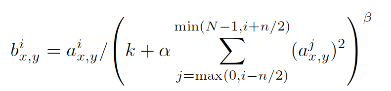

# API
## tf.nn.lrn
* 全称： 局部响应归一化层( Local Response Normalization)

* $b_{x,y}^i$是归一化的值。$i$是通道的位置，代表更新第几个通道的值，$x$与$y$代表带更新像素的位置

* $a_{x,y}^i$是输入值，是激活函数$ReLU$的输出值

* $k,alpha,beta,n/2$都是自定义系数

总结来说，是对输入值$a_{x,y}^i$除以一个数达到归一化的目的

## tf.nn.max_pool
* 说明：tf.nn.max_pool(value, ksize, strides, padding, name=None)

* value：需要池化的输入，[batch, height, width, channels]

* ksize：池化窗口的大小，一般是[1, height, width, 1]，因为不想在batch 和channels上做池化，所以这两个维度设为1

* strides : 窗口在每个维度上的滑动的步长，一般是[1, strides, strides, 1]

* padding ： 可以去'valid' 或者 ' same'
