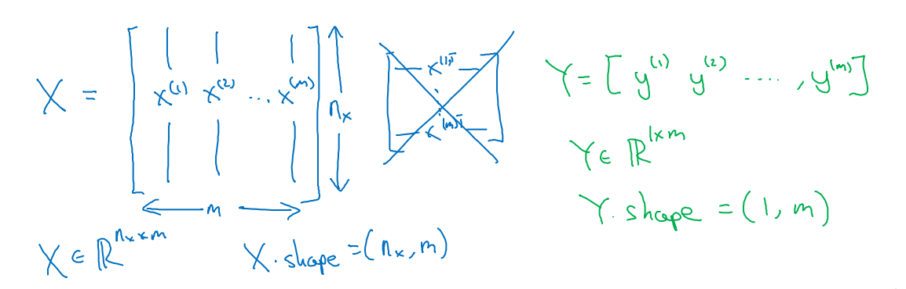
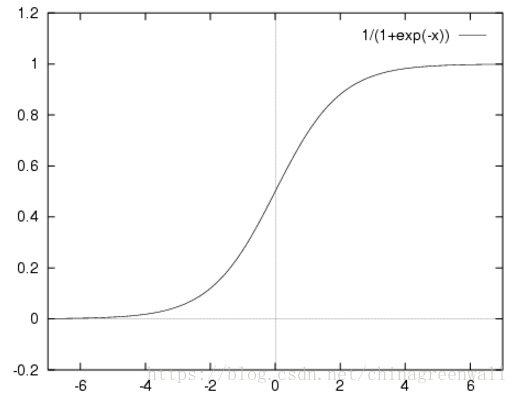
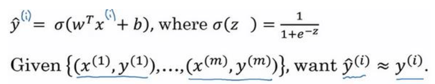

# 1神经网络的编程基础

## 二分类

* n：表示特征数量

* m：数据集样本个数

* x：表示一个nx维数据，此为一个输入数据，维度为(nx,1)

* y：表示输出结果，取值为(0,1)

* (x(i),y(i)):表示第i组数据，可能是训练数据，也可能是测试数据

* X=[x(1),x(2),x(3),...,x(m)]:表示所有的训练数据集的输入值，放在一个nx*m的矩阵中;
   
  X.shape=(nx,m)

* Y=[y(1),y(2),y(3),...,y(m)]:表示所有的训练数据集的输出值，维度1*m;
    
    Y.shape=(1,m)

## Logistic Regression
给定了输入特征$X$，算法做出预测，预测值记作${\rm{\hat y}}$，也就是对实际值$y$的估计

用$w$表示逻辑回归的参数，$w$也是一个$nx$维向量，再加上实数$b$作为偏差，那么${\rm{\hat y}}$可以表示为：

${\rm{\hat y}} = {{\rm{w}}^{\rm{T}}}x + b$

这时我们得到一个关于输入$x$的线性函数，为了使得输出的估计值范围在$[0,1]$，需要引入$Sigmoid$函数：

$y = Sigmoid({w^T}x + b) = \sigma ({w^T}x + b)$

其中$Sigmoid$函数为：

$\sigma (z) = \frac{1}{{1 + {e^{ - z}}}}$

* **补充：**

* 先计算出函数的一阶导数，后面需要用到：

$\sigma (z)' = \sigma (z)(1 - \sigma (z))$

* 梯度：即为函数图像的斜率向下的方向，也就是可以使小球向下走的方向

## Logistic Regression Cost Function
为了训练逻辑回归模型的参数$W$和参数$b$，需要一个代价函数。

在逻辑回归中常用的损失函数为交叉熵损失函数：

  $$L(\hat y,y) =  - y\log (\hat y) - (1 - y)\log (1 - \hat y)$$

当$y=1$时，损失函数为：$L =  - \log (\hat y)$，如果想要损失函数$L$尽可能得小，那么${\hat y}$就要尽可能得大，因为$Sigmoid$函数的取值范围是$[0,1]$，所以${\hat y}$会无限接近1

当$y=0$时，损失函数：$L= - \log(1-\hat y)$,如果想要损失函数$L$尽可能得小，那么${\hat y}$就要尽可能得小，因为$Sigmoid$函数的取值范围是$[0,1]$，所以${\hat y}$会无限接近0

以上为Loss function，即在单个训练样本中的损失函数。为了衡量算法在全部训练样本上的表现如何，我们需要定义一个算法的代价函数，这个代价函数就是对$n$个样本的损失函数求和除以n。

  $$C =  - \frac{1}{m} \sum_{i=1}^m [y^{(i)}\log (\hat y^{(i)}) - (1 - y^{(i)})\log (1 - \hat y^{(i)})]$$

## 代价函数补充
* **什么是代价函数？**

<1>. 概况来讲，任何能够衡量模型预测出来的值${\hat y}$ 与真实值$y$之间的差异的函数，都可以叫做损失函数$L(w,b)$，如果有多个样本，则可以将所有代价函数的取值求均值，记做$C(w,b)$。以下为关于代价函数的性质：

* 选择代价函数是，最好挑选对参数$w$与$b$可微的函数
* 对于每种算法来说，代价函数不是唯一的。
* $C(w,b)$是一个标量

<2>. 当我们确定了模型${\hat y}$，后面做的所有事情就是训练模型的参数$w$与$b$。

由于代价函数是用来衡量模型好坏的，我们的目标是得到最好的模型。因此训练参数的过程就是不断改变参数$w$与$b$，从而得到更小的$C(w,b)$的过程。记为：

$$\min_{w,b}C(w,b)$$

<3>. 在优化参数$w$与$b$的过程中，最常用的方法就是梯度下降法，这里的梯度就是代价函数$C(w,b)$对$w_{1},w_{2},...,w_{n},b$的偏导数，

* **代价函数的常见形式**
<1>. 在线性回归中，最常用的是均方误差(Mean squared error)，即

$$C(w,b)=\frac{1}{2m} \sum_{i=1}^m(\hat y^{(i)}-y)^2$$

* $m$：训练样本的个数
* $\hat y$：预测的y值
* $y$：原训练样本中的y值
* $i$：第$i$个样本

<2>. 在逻辑回归中，最常用的是代价函数是交叉熵，在神经网络中也会用到。

$$C =  - \frac{1}{m} \sum_{i=1}^m [y^{(i)}\log (\hat y^{(i)}) - (1 - y^{(i)})\log (1 - \hat y^{(i)})]$$

* 下面聊一下为什么神经网络要使用交叉熵代价函数而不使用二次代价函数
<1>. 二次代价函数的不足
   
**我们希望：ANN在训练是，如果预测值与实际值的误差越大， 那么在反向传播训练的过程中，各种参数调整的幅度就要更大，从而使训练更快收敛。**
然而，如果使用二次函数训练ANN，看到的实际效果是，如果误差越大，参数调整的幅度可能更小，训练更缓慢

二次代价函数的公式如下：

$$C(w,b)=\frac{1}{2m} \sum_{i=1}^m(\hat y^{(i)}-y)^2$$

为了简单起见，以一个样本为例进行说明，此时二次代价函数为：

$$J(w,b)=\frac{(\hat y-y)^2}{2}$$

下面进行调参，采用梯度下降算法。w和b的推导如下：

$$\frac{\partial L(w,b)}{\partial w}=(\hat y -y)\sigma'(z)x$$
$$\frac{\partial L(w,b)}{\partial b}=(\hat y -y)\sigma'(z)$$

其中，$z$表示神经元的输入，$\sigma(z)$表示激活函数。从以上公式可以看出，w和b的梯度跟激活函数的梯度成正比，激活函数的梯度越大，w和b的大小调整的越快，训练收敛得就越快。

我们从函数图像上可以看出，当$z$越大时，$\sigma'(z)$的值就会越小，对于$w$的下降会很慢。对于$b$也是同样的。

<2>. 交叉熵代价函数

函数公式：

$$C =  - \frac{1}{m} \sum_{i=1}^m [y^{(i)}\log (\hat y^{(i)}) - (1 - y^{(i)})\log (1 - \hat y^{(i)})]$$

同样简化操作，只对一组数据进行分析，则公式为：

$$L =  - y\log (\hat y) - (1 - y)\log (1 - \hat y)$$

计算$w$的梯度：

$$\frac {\partial L}{\partial w}=(\hat y -y)x$$

因此，$w$的梯度公式中没有了$\sigma'(z)$，$\frac {\partial L} {\partial w}$就会随着$(\hat y -y )$的增大而增大。

