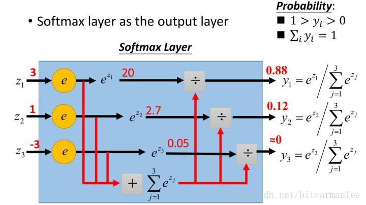

# 3softmax
## 1.softmax初探
在机器学习尤其是深度学习中，softmax是个非常常用而且比较重要的函数，尤其是在多分类的场景中使用广泛。它把一些输入映射为0-1之间的实数，并且归一化保证和为，因此多分类的概率之和也刚好为1
首先看看softmax的意思。其由两个单词组成，其中一个是max，比如有两个变量a,b。如果a>b，则max为a，反之为b。
另一个单词为soft。max存在的一个问题，如果将max看成是一个分类问题，就是非黑即白，最后输出的是一个确定的变量。更多的时候，我们希望输出的是取到某个分类的概率，或者说，我们希望分值大的那一项被经常取到，而分值小的那一项也有一定的概率偶尔被取到，所以就应用到了soft的概念，即最后的输出是每个分类被取到的概率。

## 2.softmax的定义
先上图再说

假设有一个数组$V$,$V_i$表示$V$中的第$i$个元素，那么这个元素的softmax的值为：

$$S_i = \frac{e^i}{\sum_j e^j}$$

## 3.softmax VS k个二元分类器（logistic）
* softmax更适用于类别的互斥的情况下
* k个二元分类器更适用于类别不互斥的情况