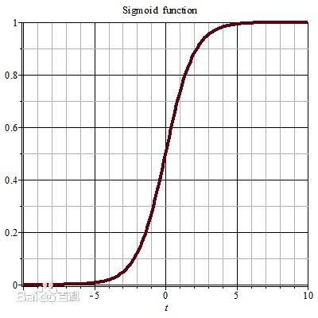
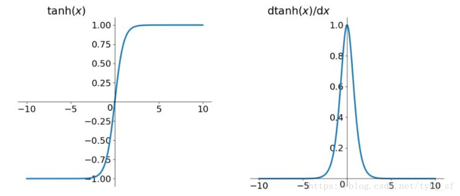
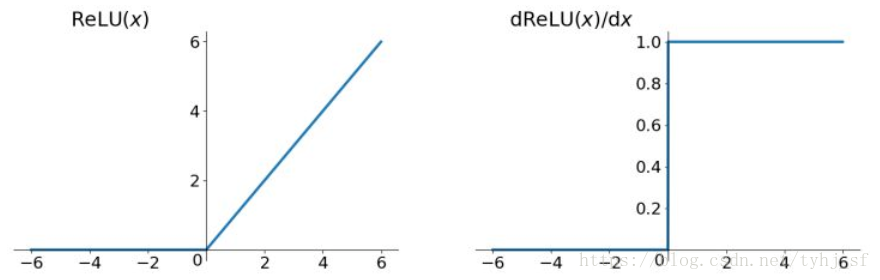

# 1. 5.激活函数的作用
 神经网络为什么要使用激活函数？

## 1.1. 1.激活函数的几种形式

$$simoid 函数也称 S 曲线：f(x)=\frac{1}{1+e^{-x}}$$

$$tanh:f(x)=tanh(x)$$

$$ReLU：f(x)=max(x,0)$$

$$softmax: f(x)= \frac{e^x}{\sum_j e^j}$$

## 1.2. 2.激活函数的作用
* **激活函数是用来加入非线性因素的，因为线性模型的表达力不够**

    如果不用激活函数（其实相当于激活函数是 f(x) = x），在这种情况下你每一层输出都是上层输入的线性函数，很容易验证，无论你神经网络有多少层，输出都是输入的线性组合，与只有一个隐藏层效果相当，这种情况就是多层感知层（MLP）了。

    所以我们挑选激活函数的时候要注意：
    
    * 非线性
    
    * 可导的，因为要做梯度下降
    
    * 易于计算的
    
    * 输出空间最好是有限的

## 1.3. 3.注意

* $sigmoid:$

    通过图像我们可以看出，$sigmoid$的图像两端都趋于平坦.

 

* 缺点：
    * 在反向传播过程中会导致梯度爆炸和梯度消失

    * $sigmoid$的output不是0均值（这里还没有接触过）
* $tanh:$

 

* 特点：
    * $tanh$解决了$sigmoid$函数的不是zero-centered输出问题
    
    * 但是梯度消失的问题还是存在

* $Relu:$

 

* 特点：
    * 解决了梯度消失的问题
    * 计算速度非常快

## 1.4. 总结

**激活函数是用来加入非线性因素的，提高神经网络对模型的表达能力，解决线性模型所不能解决的问题**

**参考：**

    https://blog.csdn.net/qq_35290785/article/details/89349635
    https://blog.csdn.net/u014088052/article/details/50923924