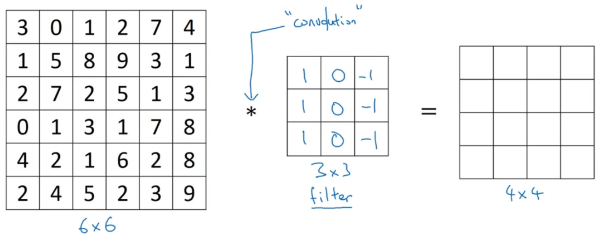
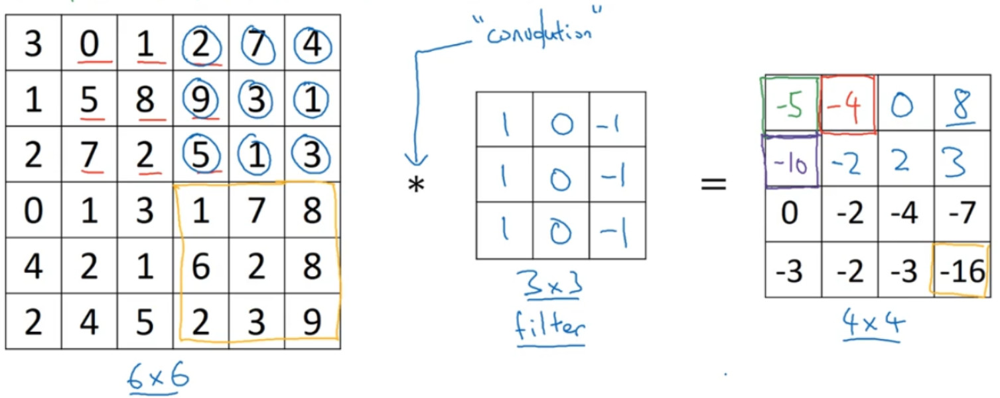
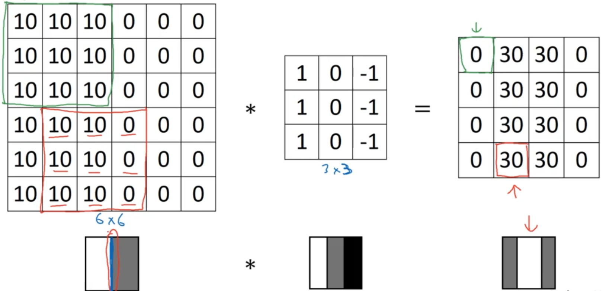
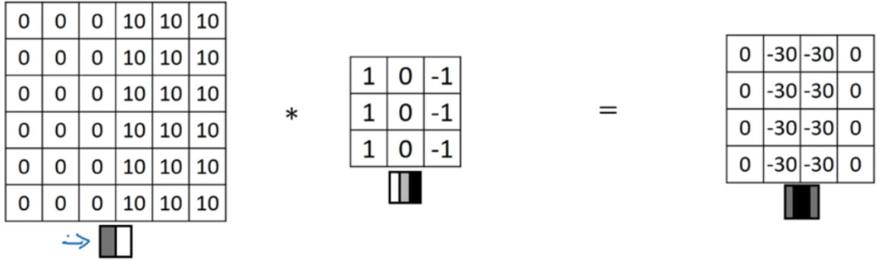
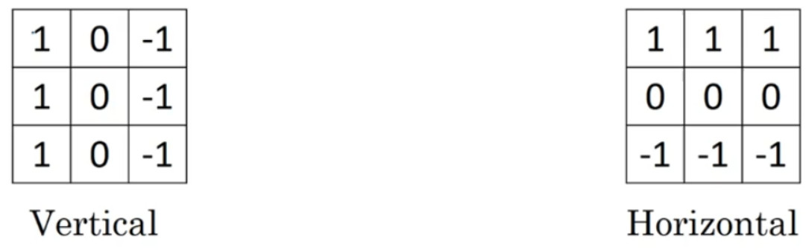
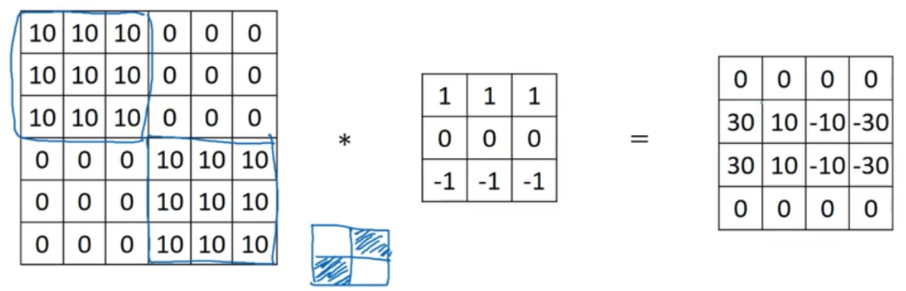
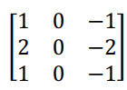
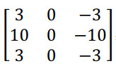

# 1-2边缘检测
## 1.垂直边缘检测
为了检测图像中的垂直边缘，对一个6x6x1的灰度图像，我们可以构造一个3x3矩阵。这个3x3的矩阵，一般称之为卷积核，或者是过滤器。

经过卷积计算，就变成了下一张图

因此6x6矩阵和3x3矩阵进行卷积运算得到了4x4矩阵。左边可以理解为一张图片，中间理解为过滤器，右边的图片理解为结果图片。这个就是垂直边缘检测器。

下面来解释一下什么叫做垂直边缘检测？

举个栗子，对于下面这张6x6的图片，其左半边是白色的，右半边是灰色的，从白色到深色，可以认为是RGB的表示，越大越白。因此在图片里面有一条特别明显的垂直边缘在中间。经过过滤器过滤后，就得到了右边这张图片，中间的白色部分就表示垂直边缘的所在。

因为这张图片只是6x6的，所以感觉看起来怪怪的，而在实际中的图片有可能是1000x1000的，并不会出现这样的情况。

* 卷积定义：两个变量在某范围内相乘后求和的结果，一般都用*来表示

## 2.更多边缘检测内容
区分正边和负边，实际上是由亮到暗（正边）与由暗到亮（负边）的区别，也就是边缘的过渡，而且最后的结果图片的中间也改变了，但是均表示垂直边缘位于中间

左边这个3x3的过滤器，他可以检测出垂直的边缘。右边的过滤器它能够检测出水平的边缘。

下面看一个更复杂的例子，图片的右上角比较暗，左下角也比较暗，通过水平过滤器可以得到右边的矩阵。在其左半边中间白，在其右半边中间暗

通过使用不同的过滤器，可以找出垂直或是水平的边缘。

这个叫做sobel的过滤器，它的优点在于增加了中间一行元素的权重。这使得结果的鲁棒性会更高一些。

这个Scharr过滤器。先了解一下