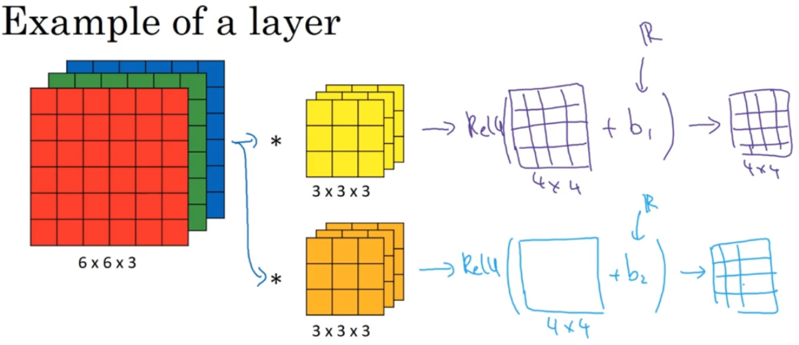

# 单层卷积网络

图中有两个卷积核，分别于左边的矩阵进行卷积运算，然后得到右边的结果，形成卷积神经网络层，然后加上偏差，它是一个实数，通过Python的广播机制给他们都加上偏差，两个结果所加上的偏差不相同。之后就要应用非线性函数了，我们这里使用的是一个非线性激活函数ReLU，输出结果是一个4x4矩阵。

* **前向传播**
    * 图中的前向传播操作就是：${z^{[1]}} = {W^{[1]}}{a^{[0]}} + {b^{[1]}}$，其中$a^{0}=x$ ，执行非线性函数得到$a^{[1]}$，即$a^{[1]}=g(z^{[1]})$

## 总结

* $f^{[l]}$：过滤器大小

* $p^{[l]}$：padding的数量，有两种用法，第一种是：valid卷积，即无padding。第二种是：same卷积。维持图片大小，要加padding。

* $s^{[l]}$：步幅

* 这一层的输入：$n_H^{[l-1]}\times n_W^{[l-1]}\times n_C^{[l-1]}$

* 这一层的输出：$n_H^{[l]}\times n_W^{[l]}\times n_C^{[l]}$

* 输出图像的高度：$n_H^{[l]}=\left\lfloor {\frac{{{n_H}^{[l - 1]} + 2{p^{[l]}} - {f^{[l]}}}}{{{s^{[l]}}}} + 1} \right\rfloor$

* 输出图像的宽度：$n_W^{[l]}=\left\lfloor {\frac{{{n_W}^{[l - 1]} + 2{p^{[l]}} - {f^{[l]}}}}{{{s^{[l]}}}} + 1} \right\rfloor$

* 输出图像的通道数量就是神经网络中这一层所使用的的过滤器的数量。

* 过滤器中通道的数量必须与输入中通道的数量一致。

* 过滤器的维度等于：$f^[l]\times f^[l] \times n_C{[l-1]}$

* 当执行批量梯度下降时，如果有m个例子，就是有m个激活值的集合，那个输出：

$$A^{[l]}=m\times n_H^{[l]} \times n_W{[l]} \times n_C^{[l]}$$ 

* 过滤器的数量：$n_C^{[l]}$，权重就是所有过滤器的集合再乘以过滤器的总数量，即$f^[l]\times f^[l] \times n_C{[l-1]} \times n_C^{[l]}$

* 每个过滤器都有一个偏差参数，它是一个实数。偏差是：$1 \times 1 \times 1 \times n_C^{[l]}$的四维向量