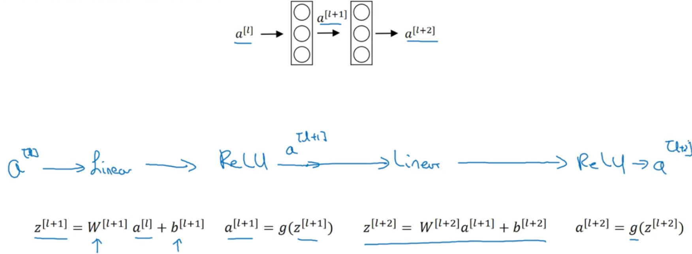
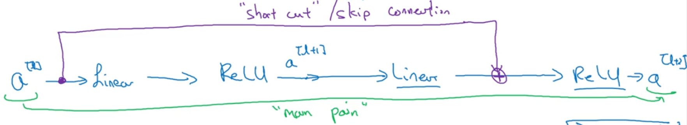
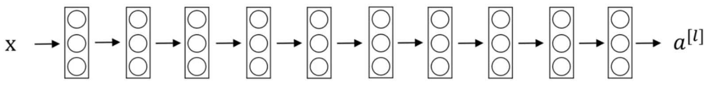
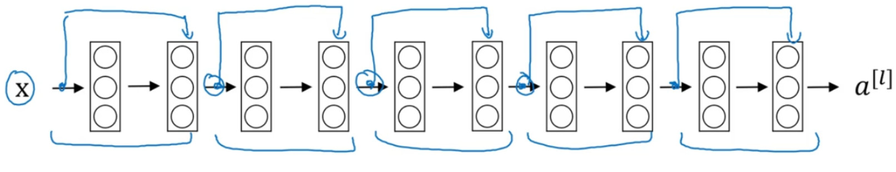
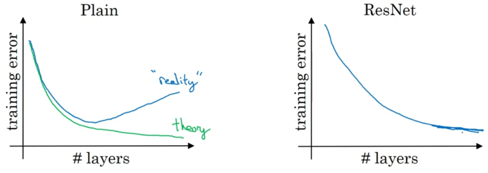

# 残差网络
首先，非常非常深的神经网络是很难训练的，因为存在梯度消失和梯度爆炸的原因。

* 残差：在数理统计中是指实际观察值与估计值（拟合值）之间的差。

    假设我们想要找一个$x$，使得$f(x)=b$，给定一个$x$的估计值$x_0$，残差就是$b-f(x_0)$
## Residual block(残差块)
* ResNet是由残差块构建的

上面这幅图是一个神经网络行走的主路线

而在残差网络中有一点变化，我们直接将$a^{[l]}$直接向后，拷贝到神经网络的深层，在ReLU非线性激活函数前加上$a^{[l]}$，这是一条捷径。$a^{[l]}$的信息直接到达神经网络的深层，不再沿着主路径传递，就变成了这样的ReLU了，即：$a^{[l+2]}=g(z^{[l+2]}+a^{[l]})$也就是加上的这个$a^{[l]}$产生了一个残差块。

所以构建一个$ResNet$网络就是通过将很多这样的残差块堆积在一起，形成了一个很深的神经网络

如上图所示，5个残差块连接在一起构成了一个残差网络

如果我们使用标准优化算法训练一个普通网络，比如梯度下降算法。如果没有残差，没有这些捷径或者跳跃连接，会发现随着网络深度的加深，训练错误会先减少，然后增多。而理论上，随着网络深度的加深，应该训练得越来越好才对。

有了$ResNet$就不一样了，即使网络再深，训练的表现也很不错。